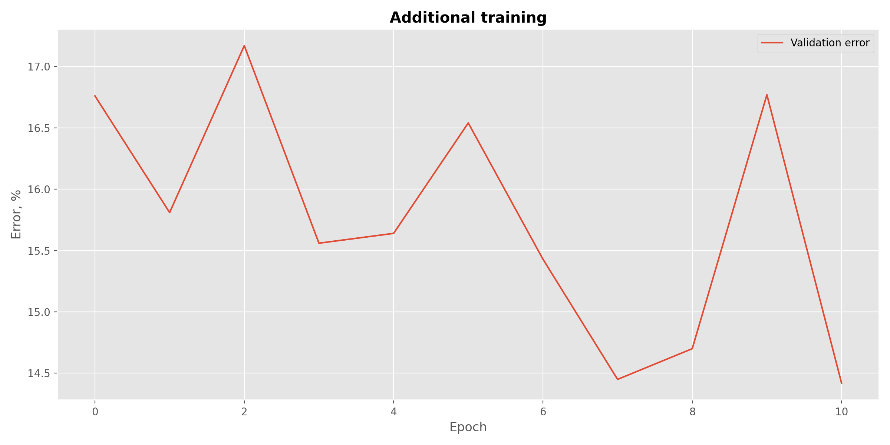

# Quick introduction

---

### Project structure

```bash
.
├── data                      # CIFAR10 dataset (in this case downloaded with PyTorch)
├── notebooks
├── output                    
│   ├── primary_train         # Model parameters and accuracy history after primary training
│   ├── additional_train      # Model parameters and accuracy history after additional training
│   └── ...                   # Generated figures
├── src                       # Source code files for training and results visualisation
├── requirements.txt
└── README.md
```

Despite best practices, model parameters are included in this repository to make everyone's lives easier.

### How to run

Run the following in you command line interpreter:

```bash
python main.py
```

No arguments are can be passed. Hyperparameters setting and minimal adjustments can be done by altering `global_vars.py`
in `src` directory. Some other adjustments can be done by altering `main.py` (for example, to download dataset change 
flags `download` at **lines 41 and 47** or to alter **line 58** to define whether the model should load pre-trained 
parameters or start from scratch).

Such decision is motivated by the desire to *keep it simple* for now and to speedup the development
process. This project only solves a single task (described
[here](https://github.com/machine-intelligence-laboratory/MILTestTasks/tree/task/Pruning)). 

### Dependencies

Only tested with **Python 3.9.x**. The full list of dependencies can be found in `requirements.txt`. This file contains 
exhaustive list of packages I use as a **general purpose environment**, so not all the present packages are actually 
used here.

### TODO's (further work)

- Finish and test ThiNet filter-level pruning method [[1]](https://arxiv.org/abs/1707.06342)
- Add visualisation for the model performance before and after puring

# Results discussion

---

Training was performed in two stages:
- Primary training
- Additional training

**Primary training** was performed with fan-in weights initialization until the model reaches plateau. Learn rate was
reduced by 1e-1 after 30 epochs and by 1e-2 after 60 epochs. Hyperparameters and optimization algorithm are picked
according to the original work on ResNet [[2]](https://arxiv.org/abs/1512.03385). Hyperparameters are given in the
table below. Despite train accuracy reached 90%+, **the best validation accuracy constituted 88%**.

| Hyperparameter         | Value |
|------------------------|-------|
| Starting Learn Rate    | 1e-2  |
| Minibatch Size         | 128   |
| SGD Momentum           | 0.9   |
| Weight Decay           | 1e-4  |

Whereas first learning rate adjustment at epoch 30 made an impact as seen in the figure below, the second didn't exhibit
any considerable effect on the training process. This may be indicative of suboptimal solution. The first reason one might
think of is insufficient training. In fact, this is likely to be so. With a higher learn rate given model has more potential 
to discover local minima nearby the global or just good enough local one. Therefore, early learn rate adjustments can 
cause the model to stack at suboptimal solutions. It is anticipated that longer train times and less agressive learn rate
reduction will result in much better results.


**Additional training** essential is an attempt to improve previously obtained results by training with learned parameters
but higher learn rate. The idea is basically to overshoot the suboptimal solution space and reach a "better place". This 
step wasn't fully run due to time constraints.



Pruning step would potentially spoil model accuracy. Decline in accuracy, however, depends on the degree of compression
according to [[1]](https://arxiv.org/abs/1707.06342) and sometimes can be performed almost without any damage to the model.